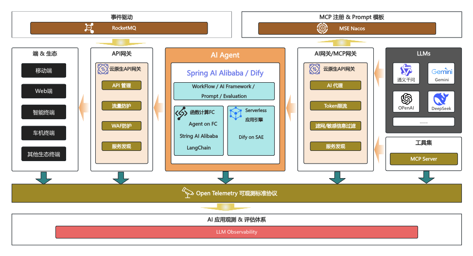
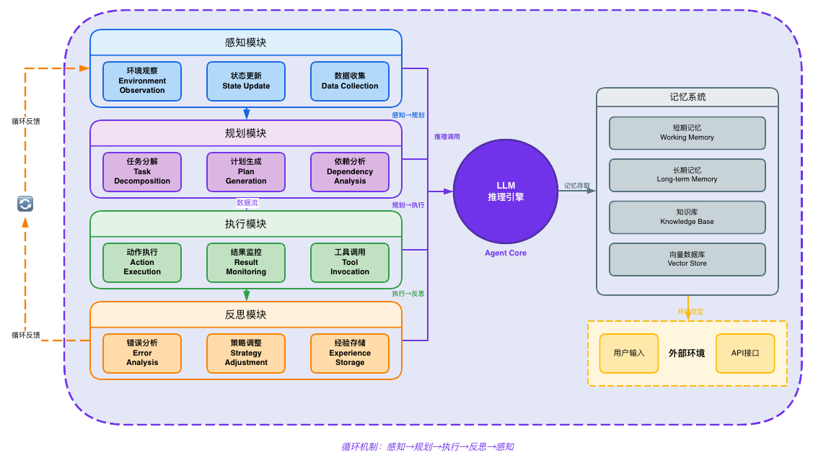

# Agent 开发

## Agent 架构、概念与关系

### Agent 架构图

**Agent 核心与外部组件架构图**

**Agent 核心架构图**

### 重要概念与关系

- **提示词工程**
	（如何描述问题）
- **Agent 框架**
	（包括 LLM 接入、工具、记忆、规划器）
	- LangChain
	- LlamaIndex
	- AutoGen
	- CrewAI
	- Swarm
- **Agent 系统能力**
	- Planning：自行对任务进行详细拆解，生成任务计划
		- 单路径推理（只有一条推理链，思维链CoT）
		- 多路径推理（有多条推理链，思维树ToT）
	- Action：按任务计划一步步执行
	- Observation：Action过程中，应当能动态感知环境反应，动态调整规划
	- Tool_call：工具调用能力
	- Learning： 自主学习好坏case、外部新知识、新工具，不断进化
- **工作模式**
	- ReAct （思考->行动->观察 循环）
	- SelfReflection（反思，用于在 ReAct失败后进行反思）
		ActorLLM（ReAct）执行失败后，将结果以及环境信息（反馈信息）分别发给 EvaluatorLLM 和 Self-reflectionLLM，Self-reflectionLLM 等 EvaluatorLLM 输出评分后，结合反馈信息进行反思，然后将反思结果存储到长期记忆，后续执行类似工作会加载反思结果。
- **Agent 记忆**
	（LLM 本身不做任何记忆，为了让它知道以往的行动需要每次都将历史信息随新消息一起装入有限的上下文）
	- 短期记忆（装入到上下文的记忆数据）
	- 长期记忆（借助向量数据库、外部文件等存储的记忆数据）
		- RAG 是借助向量数据库实现的，可以用于长期记忆
- **RAG**
	（检索增强生成，拓展存储和访问领域知识）
	- 实现工具框架
		- OpenAI Embeddings
		- Sentence Transformers
		- Cohere Embeddings
		- FAISS（本地向量库）
		- Pinecone/Weaviate/Chroma/Milvus（托管向量DB）
- **工具**
	- FunctionCall
	- MCP
	- Skills
- **LLM 接入**
	- 多种 API 协议支持
		- OpenAI
		- Anthropic API
		- Google API
		- ...
- **工具调用**
	（Agent框架中基本都支持了工具调用）
- **Profile**
	（Agent 档案）
- **Percept**
	（Agent 对环境的感知能力）
- **高级推理**
- **多 Agent 协作**
	针对复杂任务，如果一个上下文空间无法处理，可以设置多个 Agent 协作完成。
	多 Agent 架构：
	- 垂直协作架构：有一个管理 Agent 负责管理 Agent 中间的通信，也可以分配任务给专业化的Agent。
	- 水平协作架构：无固定主从关系，Agent之间地位平等，通过共享记忆或通信协议进行协商，共同决策。
	- 混合架构：结合上面两种方式，在一个类业务流程中，根据具体情况，部分使用垂直架构，部分使用水平架构
- **Agent 发展史**
	AI-Agent -> Multi-Agent -> Agentic-AI

## 参考

- [硬核，40张图全面拆解AI Agents全栈技术框架！](https://zhuanlan.zhihu.com/p/32230066307)
- [企业级Agentic AI架构设计](https://aws.amazon.com/cn/blogs/china/enterprise-level-agentic-ai-architecture-design/)
- [AgentGuide](http://github.com/adongwanai/AgentGuide)
