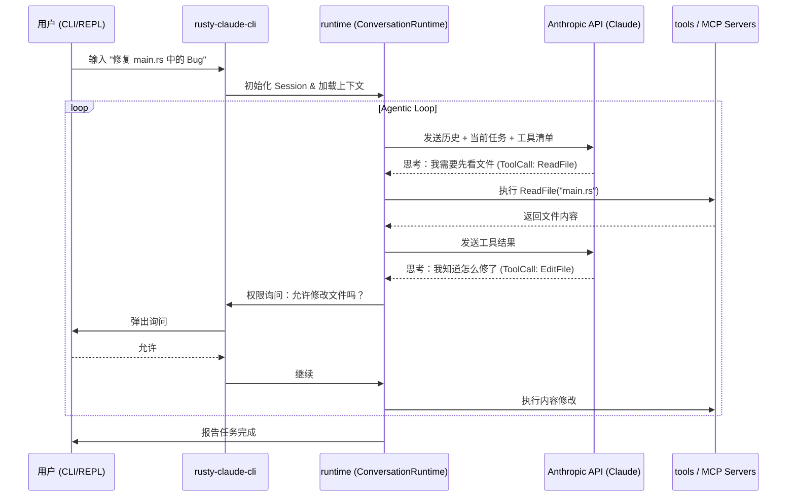

# Claw Code

## 项目结构和模块说明

项目由 lobsters/claws 自主维护。
主要包含两部分： Agent 系统（`./rust/`）、Python 前端（`./src/`）。

```sh
rust                     # Claw Code 真正干活的代码
├── Cargo.lock
├── Cargo.toml
├── crates
	├── api                          # (5.5k) 网络通信层，封装了 Anthropic 和 OpenAI 兼容的 API 客户端，处理 HTTP 请求、SSE 流式解析以及 OAuth 认证 
	├── commands                     # (4.2k) 斜杠命令注册表，定义了 `/status`, `/compact`, `/clear` 等交互式干预命令。
	├── compat-harness               # (358) 功能自动对账工具
	├── mock-anthropic-service       # (1.1k) 测试模拟服务，提供一个本地的 API Mock 服务，用于确定性的集成测试
	├── plugins                      # (3.8k) 插件系统（计划中），提供 Hook（PreToolUse/PostToolUse）机制和插件定义规范
	├── runtime                      # (25.1k) Agent 执行引擎，负责负责 `ConversationRuntime` 状态机、会话持久化、配置加载、权限控制、系统提示词组装
	├── rusty-claude-cli             # (11.3k) 入口程序，实现交互式REPL、单词Prompt命令、流失输出渲染、CLI参数解析等
	├── telemetry                    # (527) 遥感与统计，负责监控会话事件、Token 使用量统计及成本计算
	└── tools                        # (7.3k) 工具实现库，包含内置的 Bash 执行、文件读写（ReadFile/WriteFile）、代码编辑、Web 搜索等工具的具体逻辑
├── MOCK_PARITY_HARNESS.md
├── mock_parity_scenarios.json
├── PARITY.md
├── README.md
├── scripts
├── TUI-ENHANCEMENT-PLAN.md
└── USAGE.md

src                      # 对应 Cluade Code 的 功能清单（TS实现）用于表示功能迁移进度
```

本地启动：
```
cd rust
cargo build --workspace
export ANTHROPIC_API_KEY="sk-ant-..."
./target/debug/claw --help
./target/debug/claw prompt "summarize this repository"
```

启动调试：
安装 Rust-Analyzer CodeLLDB 插件，然后让 AI 创建一个 launch.json。

## 工作流程




1. **入口 `rusty-claude-cli/src/main.rs`**
	main() -> run();
	指令列表：
	**Repl**： **交互式模式（最常用模式），启动一个 Read-Eval-Print Loop (REPL)，Agent 会在这里与你持续对话、分析代码并执行任务**
	Prompt：单次指令模式，执行完即退出
	ResumeSession：恢复会话，比如重新打开历史会话，恢复上下文
	Login/Logout：身份认证，处理与 LLM 对接时的身份认证，管理 API Key 和访问令牌
	**Init**：初始化项目，读取并分析项目文件生成必要的配置文件，比如 claude.json、CLAUDE.md
	Sandbox: 沙箱检查，以Linux 环境为例，使用 Linux unshare 命令创建隔离环境（unshare 会创建新的PID命令空间）
	Status：查看状态快照，展示当前使用的模型、已消耗的 Token 数量、预计成本以及权限模式
	Agents / Mcp / Skills：查看配置的 Agent、MCP、Skills
	PrintSystemPrompt：打印出最终发给 LLM 的系统 Prompt 全文
	DumpManifests：转储清单。调用 compat-harness 模块，从原始的 TypeScript 源码中提取工具和命令的清单，用于新旧代码对比
	BootstrapPlan：打印启动流程图，展示 Agent 启动时会经过哪些逻辑阶段
	- CliEntry
	- FastPathVersion
	- StartupProfiler
	- SystemPromptFastPath
	- ChromeMcpFastPath
	- DaemonWorkerFastPath
	- BridgeFastPath
	- DaemonFastPath
	- BackgroundSessionFastPath
	- TemplateFastPath
	- EnvironmentRunnerFastPath
	- MainRuntime
2. **Repl 指令工作流程**
	1. 初始化阶段：
		1. **构建 Context** (LiveCli::new): 首先初始化 LiveCli 对象。这一步非常关键，它**会加载项目配置、初始化 runtime （即 Agent 的大脑）、拉起 MCP 服务器并加载会话历史**
			```
			struct LiveCli {
				model: String,
				allowed_tools: Option<AllowedToolSet>,
				permission_mode: PermissionMode,
				system_prompt: Vec<String>,
				runtime: BuiltRuntime,
				session: SessionHandle,
			}
			```
		2. **准备感知层 (LineEditor): 创建一个支持语法高亮、自动补全和历史记录的终端编辑器**。repl_completion_candidates 会根据当前上下文（如可用的斜杠命令、文件名等）生成补全建议。
		3. 展示状态 (startup_banner): 打印那个标志性的彩色🦞图形 Banner，并显示当前模型、权限等快照信息。
	2. **交互循环阶段**
		1. 感知与输入
			程序阻塞等待用户输入
		2. 意图解析
			判断输入类型，针对处理，比如：
			/exit /quit 或 Ctrl-D：调用 cli.persist_session() 存储当前会话历史到磁盘，然后退出；
			斜杠命令：调用 cli.handle_repl_command 执行对应的处理器，不经过 LLM；
			**原生Prompt**：先 editor.push_history() 记录历史，然后调用 cli.run_turn() 交给 Agent 处理
3. **原生 Prompt 处理 cli.run_turn()， LineEditor 读取的输入信息通过这个方法传给了 LiveCli**
	1. 环境与运行时准备 (L2194) — **Context Isolation**
		- **prepare_turn_runtime(true)**: **每一轮对话（Turn）前，系统都会刷新运行时状态（BuiltRuntime, 调用 build_runtime()）。这确保了 Agent 在这一轮中拥有最新的工具配置（如新启动的 MCP 服务器）和正确的上下文**。
		- 同时启动了 hook_abort_monitor（钩子终止监控器），监听 Ctrl+C 信号，这在 Agent 运行长时间任务或插件钩子出现异常时提供了一种强行中止的保险机制。
	2. 用户反馈初始化 (L2195-L2201，向用户展示当前运行状态) — **Sense of Presence**
		- **`Spinner::new()`**: 在 Agent 进入推理状态前，立即启动终端加载动画（"🦀 Thinking..."）。这在 UX 设计层面至关重要，因为 LLM 的首包返回往往有延迟。
	3. 授权层交互准备 (L2202) — **Safety Gatekeeping**
		- **CliPermissionPrompter**: 这是一个**外部注入的授权器**。Agent 在这一轮中产生的所有“危险动作”（如文件写入、命令执行），都会回调这个授权器。它会阻塞 Agent 的执行流程，等待人类在终端上输入 `y/n` 以确认授权。
	4. **驱动大脑推理与迭代** (L2203) — **Reasoning Loop**
		- **`runtime.run_turn(input, ...)`: 这是最核心的一步。LineEditor 的输入通过这个方法传给了 BuiltRuntime，它进入了 Agent 的推理主循环。**
		- 该函数会封装请求发送给 Anthropic API。
		- 解析并执行 LLM 返回的 Tool Calls（在此期间 `Spinner` 会变成工具运行的具体状态）。
		- 将工具执行结果反馈给 LLM，直到 LLM 给出最终回复或达到迭代上限。
	5. **结果处理与记忆管理** (L2206-L2232)
		根据执行结果，进入两个分支：
		#### 成功分支 (Ok):
		- **replace_runtime**: 将执行完任务、更新了上下文的运行时数据同步回全局状态
		- **auto_compaction（记忆压缩）**: **检测到历史记录过长并触发压缩（Compaction）时，向用户发出通知。这体现了 Agent 管理自身短期工作记忆的能力**
		- **persist_session**: 立即将本轮对话的全部过程（输入、思考、工具调用、结果）保存到会话文件中
		#### 失败分支 (Err):
		- **shutdown_plugins**: 发生异常时，安全地关闭已加载的插件
		- **`spinner.fail`**: 提示“Request failed”，并将错误向上抛出
4. **推理主循环 runtime.run_turn(input, ...)**
	1. 输入捕获与记忆写入 (L301-L305)
		输入预处理: 将用户通过 CLI 输入的原始文本存入 self.session.messages。
		语义对齐: 将这一轮标注为 User 角色。此时，Agent 的大脑中已经知道“我这一轮该干什么了”。
	2. **进入推理主循环** (L312-L470) — ReAct (Reasoning and Acting) 模式
		**这是一个 loop 循环，每一圈代表一次“思考 -> 动作 -> 观察”的过程**：
		A. 预防失控 (L314-L320)
			检查**迭代次数**。如果 Agent 陷入死循环，在此处会被强行切断并抛错（RuntimeError）。
		B. 调用 LLM 发起推理 (L322-L344)
			构造快照: **将系统提示词 + 完整的历史对话记忆打包发给模型**。
			流式响应: 通过 api_client 接收流式结果，并用 build_assistant_message 组装成一个完整的助手回复。
			记录统计: 记录这一轮消耗的 Token 和缓存命中情况。
		C. 解析行动意图 (L345-L368)
			扫描 LLM 的回复。**如果回复中不包含 ToolUse**（工具调用），说明 Agent 已经想好了最终答案，通过 break 退出循环及本次 Turn。
			**如果包含 ToolUse**，则进入下一步。
		D. 安全授权与工具执行 (L370-L469) — Action Phase
			这是 Agent 最强大的特权时刻，代码分三层过滤：
			1. Pre-Hook (预处理钩子): 插件可以在此时修改参数或直接中止任务。
			2. Permission Check (权限检查): 调用 permission_policy。如果 Agent 在 read-only 模式下想删文件，或者在普通模式下想执行敏感操作，代码会通过 prompter 实时弹窗问你：“Agent 想干坏事，你准不准？”
			3. Execute (真正动手): 
				通过 tool_executor.execute 运行代码、搜索网页或读写文件。
				捕获输出。如果工具坏了（比如拼写错误），捕获报错并封装成 ToolResult。
		E. 记忆反馈 (L464-L466)
		将执行结果（无论成功还是报错）封装成 ToolResult 消息并存入 Session。
		关键点：**循环重新开始**。在下一圈中，LLM 会看到这个执行结果，并思考：“恩，文件我已经读到了，接下来我要开始修改了。”
	3. 会话整理与结束 (L472-L485)
		Maybe **Auto-Compact**: **如果对话太长、消耗 Token 太多，Agent 会在这里触发“自我记忆整理”，压缩掉老旧的信息**。
		返回 Summary: 汇总整个过程中经过了多少轮迭代、消耗了多少钱，并把结果返回给 CLI 进行展示。

## 核心机制

### 提示词层级

### **上下文自动压缩**

**触发时机**：
- 当对话历史超过 max_estimated_tokens 时触发；
- 当消息数量达到一定的数量，压缩后至少保留最近的 **4 条原始消息**（`preserve_recent_messages`）。
**压缩方式**：
系统会将对话历史划分为三部分，采用不同的处理策略：
- **头部 (Header)**：如果是第二次压缩，它会提取上一次生成的“旧摘要”。
- **中间部分 (The Body - 压缩对象)**：将除了头部和最后 4 条消息之外的所有内容扔进“脱水机”生成摘要，然后**物理删除**原始消息。
- **尾部 (The Tail - 保留对象)**：**逐字保留**最近的 4 条消息。因为这是当前任务最直接、最鲜活的上下文，不能有任何信息丢失。
**脱水摘要**：
量化统计：记录被删掉了多少条用户指令、多少次 AI 回复、调用了多少次工具。
工具图谱：列出这段历史中所有使用过的工具清单（如：bash,  read_file, grep_search）。这告诉模型：“虽然细节删了，但我之前用过这些手段。”
关键文件扫描：扫描所有消息，提取其中出现的代码路径（如 src/main.rs）。Agent 看到摘要时能立刻想起“哦，我之前动过这几个文件”。
待办任务推理 (infer_pending_work)：专门搜寻带有 "todo", "next", "remaining" 关键词的 AI 语句。这是为了确保 Agent 不会因为压缩而忘记还没干完的活。
极简时间轴：将每条消息截断到 160 个字符以内，形成一个类似“电影梗概”的时间线。
**递归合并** (Recursive Merging) — L238-L271：
如果一个会话持续很久，触发了多次压缩，它会执行 merge_compact_summaries：
- 它会将“旧的摘要”归类为 Previously compacted context。
- 将本次新增的压缩内容归类为 Newly compacted context。
- 这样，Agent 的大脑里始终维持着一个“层级化”的记忆包。

### 工具系统

### 多 Agent 实现

通过工具启用子Agent。

## 参考

- [Claude Code泄露源码分析，10分钟速通核心架构](https://www.bilibili.com/video/BV1q997BmEyo?spm_id_from=333.788.player.player_end_recommend_autoplay&trackid=web_related_0.router-related-2479604-dplt2.1775726803928.230&vd_source=e085f6b3e74d1e9c35fe18734cac42f7)
	可以借助这里的分析辅助理解 claw-code。

