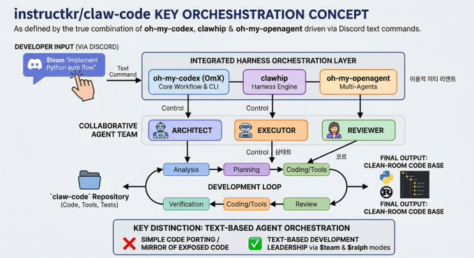

# Agent 编排

参考：
- [你需要从 claw-code 仓库中学到什么](https://x.com/realsigridjin/status/2039472968624185713)
- [一人抵一个开发团队！OpenCode最强插件Oh My OpenCode让你拥有GPT 5.2+Gemini 3 Pro+Claude Opus 4.5组合](https://www.bilibili.com/video/BV1SYrTBMEzB/?spm_id_from=333.788.recommend_more_video.0&trackid=web_related_0.router-related-2479604-9xr68.1775811443447.226&vd_source=e085f6b3e74d1e9c35fe18734cac42f7)

**应该专注于设计代理系统并设置它们之间的协调**。

两小时完成对 Claude Code 重写的 Agent 系统的架构：

**如何构建一套这样的编排系统？**

使用 Agent Harness 多智能体编排增强层框架，比如：
- [`oh-my-codex`](https://github.com/Yeachan-Heo/oh-my-codex)
	给 Codex 专用的多 Agent 编排层插件。通过分阶段的团队管道、持久的内存/状态 MCP 服务器和可扩展的钩子更快地构建。
- [`clawhip`]()
- [`oh-my-openagent`](https://github.com/code-yeongyu/oh-my-openagent)
	给 OpenCode 专用的多 Agent 编排层插件。
- [oh-my-claudecode](https://github.com/Yeachan-Heo/oh-my-claudecode) 
	给 Claude Code 专用的多 Agent 编排层插件。

## 系统架构

- **输入层**
- **编排层**
- **Agent 层**
- **执行循环**
