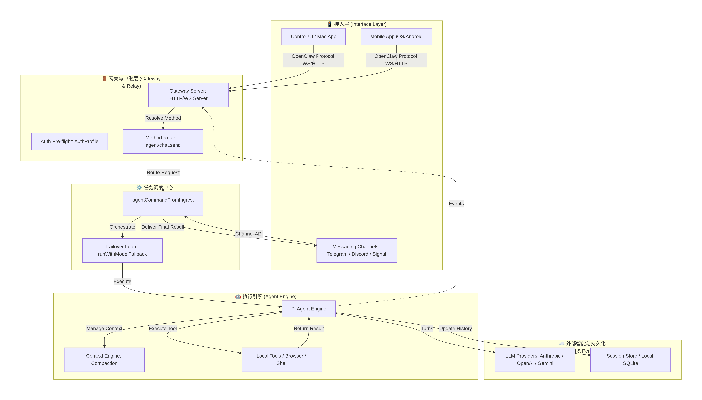

# OpenClaw 配置

## 安装
官方提供了 sh脚本和 npm 两种安装方式。
程序员还是推荐先安装 nvm 和 node.js 还有设置 npm 仓库镜像，然后使用 npm 安装；
可以先跳过配置（QuickStart 安装模式），安装完成后通过 `openclaw onboard` 专门进行配置。
```sh
npm install -g openclaw@latest
pnpm add -g openclaw@latest
openclaw --version
```
安装完成后位于node安装目录下，比如：
```sh
~/.nvm/versions/node/v24.14.1/bin/openclaw
~/.nvm/versions/node/v24.14.1/lib/node_modules/openclaw
#配置文件目录
~/.openclaw
	├── config.yaml          # 全局配置（核心）
	├── models.yaml          # 模型定义（所有可用模型）
	├── agents/              # Agent 角色配置
	│   └── default.yaml     # 默认 Agent 角色（可增加多个角色）
	├── memory/              # 记忆存储
	│   ├── core.md          # 核心记忆
	│   └── conversations/   # 对话历史
	├── plugins/             # 插件配置
	├── .env                 # 环境变量（可选）
	└── logs/                # 运行日志
```
多 OpenClaw 实例安装：
TODO。

## 组件组织架构

- **接入层** （OpenClaw的五官）
	- Control UI（Web端用户接口，推荐）
	- TUI（命令行用户接口）
	- Messaging Channels（对接第三方通信软件, 出门或者使用第三方软件内功能时使用）
	- Mac APP / Mobile APP（Android / iOS）
- **网关与中继层**
	对外表现为一个Web服务器。
- **任务调度中心**
- **执行引擎**
- **外部智能与持久化**

## 模型选择

- [PinchBench](https://pinchbench.com/)（养虾模型排行）
	- [gemini-3-flash-preview](https://ofox.ai/zh/models/google/gemini-3-flash-preview)
- LM Studio
	`openclaw onboard` 中选择 `Custom Provider`，设置模型 API Base URL： http://192.168.8.108:1234/v1 ，设置 API KEY（如果 LMStudio 没有设置 API KEY，就随便填但是不能设置为空，不要被配置向导误导，否则后面会报错），设置 `Endpoint compatibility`: OpenAI-compatible；然后选择本地模型ID。
	测试联通性：`openclaw doctor`。
## 详细配置

- [OpenClaw 模型配置完全教程：从零开始到高级玩法（2026）](https://ofox.ai/zh/blog/openclaw-model-configuration-complete-guide-2026/)

```sh
# 配置 openclaw，可以再次执行重新配置，也可以直接去修改 ~/.openclaw 下面的文件
# 还可以在 Control UI 中修改配置
openclaw onboard

# 关键配置：
# 1 模型配置（如果使用付费API、最好设定每日每月最大Token消耗数）
#   模型提供商、base_url、api_key、默认模型、兜底模型
# 2 多角色(账户)配置，比如
# 3 渠道（Channels）配置
# 4 拓展工具配置（插件、Skill）
# 5 日志配置
# 6 安全配置
```
## 常用命令

```sh
openclaw -h

openclaw gateway status
openclaw gateway start
openclaw gateway start --daemon
openclaw gateway stop

# 单独修改某个配置
openclaw config
```
